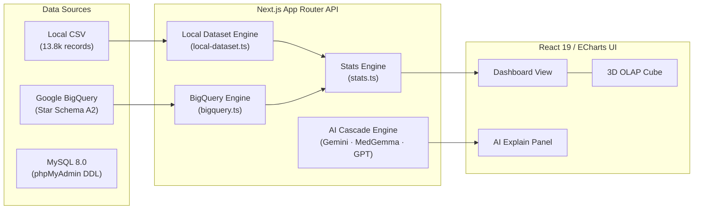

# Biomarker Observatory — Healthcare Analytics Platform

A high-performance, AI-augmented healthcare analytics platform built with **Next.js 15**, **React 19**, and **Apache ECharts**. The system ingests, normalizes, and visualizes longitudinal patient biomarker records across cohorts, featuring sub-second query performance, real-time Pearson correlation matrix calculation, 3D multidimensional OLAP slicing, and clinical AI reasoning.

---

## 📖 Table of Contents

- [Overview & Purpose](#-overview--purpose)
- [Which Files to Look at First](#-which-files-to-look-at-first)
- [Key Features](#-key-features)
- [System Architecture](#-system-architecture)
- [Data Storage & Modes](#-data-storage--modes)
- [Getting Started](#-getting-started)
- [Documentation Index](#-documentation-index)
- [Tech Stack](#-tech-stack)
- [Environment Configuration](#-environment-configuration)
- [Maintainers & Contributing](#-maintainers--contributing)

---

## 🎯 Overview & Purpose

This repository contains the complete full-stack web application, data warehouse star-schema definitions, and source medical datasets for the **Biomarker Observatory**.

### What this directory holds:
- **`src/`**: Next.js App Router full-stack codebase (React 19 presentation layer, API routes, in-memory analytics engine, BigQuery connector, statistical modules, AI providers).
- **`Dataset/`**: Raw clinical data files (`Medical Records.csv`, `MedIDDetails.csv`, `AgeCategories.csv`) and 34 SQL transformation scripts (Star Schema for BigQuery and MySQL 8.0).
- **`docs/`**: Comprehensive technical architecture, database schema, API reference, and developer onboarding manuals.

---

## 🔍 Which Files to Look at First

| Area | Primary Files | Description |
| :--- | :--- | :--- |
| **API Endpoints** | [`src/app/api/data/route.ts`](file:///Users/sooyauming/Desktop/Intern/healthcare-dashboard/src/app/api/data/route.ts)<br>[`src/app/api/patients/route.ts`](file:///Users/sooyauming/Desktop/Intern/healthcare-dashboard/src/app/api/patients/route.ts)<br>[`src/app/api/explain/route.ts`](file:///Users/sooyauming/Desktop/Intern/healthcare-dashboard/src/app/api/explain/route.ts) | Backend routes handling cohort queries, patient lookup, and AI clinical assistant responses. |
| **Local Data Engine** | [`src/lib/local-dataset.ts`](file:///Users/sooyauming/Desktop/Intern/healthcare-dashboard/src/lib/local-dataset.ts) | In-memory singleton parser and indexer for `Dataset/Medical Records.csv`. |
| **BigQuery Engine** | [`src/lib/bigquery.ts`](file:///Users/sooyauming/Desktop/Intern/healthcare-dashboard/src/lib/bigquery.ts) | Dynamic UNPIVOT and UNION ALL engine across 14 fact views. |
| **Statistical Engine** | [`src/lib/stats.ts`](file:///Users/sooyauming/Desktop/Intern/healthcare-dashboard/src/lib/stats.ts) | Real-time Pearson correlation matrix and cohort aggregate calculation. |
| **Dashboard UI** | [`src/components/Dashboard.tsx`](file:///Users/sooyauming/Desktop/Intern/healthcare-dashboard/src/components/Dashboard.tsx)<br>[`src/components/OlapCube.tsx`](file:///Users/sooyauming/Desktop/Intern/healthcare-dashboard/src/components/OlapCube.tsx) | Interactive analytics frontend with longitudinal drill-downs, scatter plots, heatmaps, and 3D OLAP Cube. |

---

## 🚀 Key Features

- **Zero-Cloud Local In-Memory Engine**: Instantly loads and indexes 13,848 patient visits, 1,154 patients, and 78 numeric biomarkers across 14 clinical panels with $<10\text{ms}$ query latency.
- **Enterprise BigQuery Integration**: Direct querying against cloud Star Schema data warehouses via 14 analytics views using dynamic schema discovery and single-pass `UNPIVOT` + `UNION ALL`.
- **4-Tier AI Clinical Cascade**: Intelligent clinical assistant prioritizing **Google Gemini** $\rightarrow$ **Hugging Face MedGemma** $\rightarrow$ **OpenAI GPT** $\rightarrow$ **Offline Reference Range Analysis Engine**.
- **Interactive Visual Analytics**:
  - **Longitudinal Trends**: 3-tier hierarchical drill-down (`Year` $\rightarrow$ `Month` $\rightarrow$ `Day`).
  - **Scatter Correlations**: Same-visit paired biomarker scatter plots with linear trends.
  - **Pearson Correlation Heatmap**: Synchronous $N \times N$ correlation matrix rendering.
  - **3D OLAP Hypercube**: 4D slicing/dicing across Time, Biomarker, Patient, and Clinical Panel.
- **Searchable Patient Discovery**: Real-time autocomplete across all 1,154 cohort patient IDs.

---

## 🏛️ System Architecture



For complete architectural details, see [System Design Specification](docs/SYSTEM_DESIGN.md).

---

## 💾 Data Storage & Modes

| Data Mode | Configuration | Characteristics |
| :--- | :--- | :--- |
| **Local In-Memory CSV** *(Default)* | `DATA_SOURCE=local` | Zero-cloud, instant responses, loads `Dataset/Medical Records.csv` directly. |
| **BigQuery Star Schema** | `DATA_SOURCE=bigquery` | Cloud data warehouse querying 6 dimensions & 14 fact views in dataset `A2`. |
| **MySQL 8.0 Relational** | Import `Dataset/Script/MySQL/healthcare_dashboard_mysql.sql` | Standard SQL dump for phpMyAdmin / MySQL relational databases. |
| **Synthetic Demo Mode** | `DEMO_MODE=true` | Deterministic PRNG simulation for testing without data files. |

For complete schema details, see [Database Schema Specification](docs/DATABASE_SCHEMA.md).

---

## 🏁 Getting Started

```bash
# 1. Clone the repository
git clone https://github.com/SooYM/Healthcare-Analysis.git
cd Healthcare-Analysis

# 2. Install dependencies
npm install

# 3. Configure environment
cp .env.example .env.local

<<<<<<< HEAD
1.  **Clone the repository**:
    ```bash
    git clone <repository-url>
    cd healthcare-dashboard
    ```

2.  **Install dependencies**:
    ```bash
    npm install
    ```

3.  **Environment Setup**:
    Copy the example environment file:
    ```bash
    cp .env.example .env.local
    ```
    Fill in your GCP credentials and API keys in `.env.local`. If no credentials are provided, the app will default to **Demo Mode** with synthetic data.

### ☁️ Server Deployment Setup for BigQuery

When deploying the dashboard on a production server (like a VPS, Vercel, or Docker container), you must configure the Google BigQuery credentials securely:

1. **Create the Service Account Key**:
   - Go to the **Google Cloud Console** > **IAM & Admin** > **Service Accounts**.
   - Create a service account (or select an existing one) and grant it the `BigQuery Data Viewer` and `BigQuery Job User` roles.
   - Go to the **Keys** tab, click **Add Key** > **Create new key** > **JSON**.
   - Download the file and place it securely on your server (e.g., in `.secrets/bigquery-sa.json`).

2. **Configure the Environment Variables**:
   In your production `.env` or server environment variables, configure the connection:
   ```env
   # Set the path to the downloaded JSON key
   GOOGLE_APPLICATION_CREDENTIALS=./.secrets/bigquery-sa.json
   
   # Set your Google Cloud Project ID
   GCP_PROJECT_ID=healthcare-dashboard-495507
   
   # Specify the dataset name where your views are located
   BIGQUERY_DATASET=HealthcareDataset
   
   # Provide the comma-separated list of your 14 views
   BIGQUERY_VIEW_NAMES=View_Fact_Urine,View_Fact_CBC,...
   ```

4.  **Load the Dataset into BigQuery** *(optional — only needed for live data)*:
    - Upload the 3 CSVs from `Dataset/` to your BigQuery dataset (`HealthcareDataset`).
    - Run the SQL scripts in `Dataset/Script/` in order: **Dimension → Fact → View Fact**.
    - Or follow the consolidated instructions in `Dataset/Script 2.0.pdf`.

5.  **Run locally**:
    ```bash
    npm run dev
    ```
    Open [http://localhost:3000](http://localhost:3000) in your browser.

## ⚙️ Environment Variables

| Variable | Description |
| :--- | :--- |
| `DEMO_MODE` | Set to `true` to force synthetic data even if GCP is configured. |
| `GOOGLE_APPLICATION_CREDENTIALS` | Path to your GCP Service Account JSON key. |
| `GCP_PROJECT_ID` | Your Google Cloud Project ID. |
| `BIGQUERY_DATASET` | The BigQuery dataset to query (default: `A2`). |
| `BIGQUERY_VIEW_NAMES` | Comma-separated list of BigQuery view names to UNION ALL (e.g. all 14 `View_Fact_*` views). |
| `BIGQUERY_TABLE_FQN` | Fully qualified name of a single BigQuery table (alternative to `BIGQUERY_VIEW_NAMES`). |
| `BQ_COL_PATIENT_ID` | Column name for patient ID in your views (default: `Original_MedID`). |
| `BQ_COL_VISIT_DATE` | Column name for visit date in your views (default: `Test_Date`). |
| `VERTEX_LOCATION` | GCP region for Vertex AI (e.g., `us-central1`). |
| `VERTEX_MODEL` | Vertex AI model name (e.g., `gemini-1.5-flash`). |
| `GEMINI_API_KEY` | Google Gemini API key for the primary LLM explain provider. |
| `GEMINI_MODEL` | Gemini model name (default: `gemini-2.5-flash`). |
| `HUGGINGFACE_API_KEY` | Hugging Face token used for MedGemma inference. |
| `HUGGINGFACE_MODEL` | Hugging Face model id (default: `google/medgemma-27b-text-it`). |
| `OPENAI_API_KEY` | OpenAI API key for fallback interpretation services. |

## 📁 Project Structure

```text
src/
├── app/            # Next.js App Router (pages and API routes)
│   └── api/        # Backend endpoints (data, explain, patients, health)
├── components/     # React components (Dashboard, OlapCube, etc.)
├── lib/            # Shared utilities (BigQuery client, AI logic, stats)
│   ├── bigquery.ts       # BigQuery UNPIVOT queries, dynamic column discovery
│   ├── gemini.ts         # Google Gemini API provider (primary LLM)
│   ├── huggingface.ts    # HuggingFace MedGemma provider (clinical)
│   ├── openai.ts         # OpenAI GPT-5.5 provider (fallback)
│   ├── clinical-ranges.ts # ~40 biomarker reference ranges + pattern detection
│   ├── stats.ts          # Pearson correlation, summary statistics
│   ├── demo-data.ts      # Synthetic data generator for demo mode
│   └── env.ts            # Zod-validated environment configuration
├── types/          # TypeScript definitions
Dataset/
├── AgeCategories.csv       # Age-range → life-stage mapping (7 rows)
├── MedIDDetails.csv        # Patient demographics (1,155 rows)
├── Medical Records.csv     # Lab results (13,849 rows, 96 columns)
├── Script 2.0.pdf          # Original consolidated SQL reference (58 pages)
├── Script/
│   ├── Dimension/          # 6 dimension table SQL scripts
│   ├── Fact/               # 14 fact table SQL scripts
│   └── View Fact/          # 14 analytics view SQL scripts
├── README.md               # Dataset architecture & schema docs
├── walkthrough.md          # Step-by-step SQL execution guide
└── pseudocode.md           # Pseudocode for every SQL object
public/             # Static assets
scripts/            # Utility scripts for data processing or deployment
PSEUDOCODE.md       # Detailed pseudocode & system walkthrough
=======
# 4. Start local development server
npm run dev
>>>>>>> bb369b3 (feat(core): integrate in-memory dataset loader, add comprehensive documentation and system architecture)
```

Open **http://localhost:3000** to explore the observatory. For step-by-step developer instructions, see [Getting Started Guide](docs/GETTING_STARTED.md).

---

## 📚 Documentation Index

Detailed documentation is available in the [`docs/`](docs/) directory:

- [**System Design & Architecture (`docs/SYSTEM_DESIGN.md`)**](docs/SYSTEM_DESIGN.md): Subsystem designs, sequence diagrams, latency benchmarks, and component contracts.
- [**Database & Star Schema Reference (`docs/DATABASE_SCHEMA.md`)**](docs/DATABASE_SCHEMA.md): Complete Data Dictionary, ER diagrams, 6 Dimensions, 14 Fact tables, and Analytics Views.
- [**REST API Reference (`docs/API_REFERENCE.md`)**](docs/API_REFERENCE.md): JSON endpoints, payload schemas, error handling, and curl examples.
- [**Developer & Setup Guide (`docs/GETTING_STARTED.md`)**](docs/GETTING_STARTED.md): Prerequisites, build scripts, debugging, and deployment instructions.
- [**Algorithmic Walkthrough (`PSEUDOCODE.md`)**](PSEUDOCODE.md): Mathematical pseudocode for correlation, unpivoting, and OLAP cube calculations.
- [**Dataset Guide (`Dataset/README.md`)**](Dataset/README.md): Detailed inventory of raw CSV files, SQL scripts, and MySQL schemas.

---

## 🛠️ Tech Stack

- **Framework**: [Next.js 15](https://nextjs.org/) (App Router, TypeScript 5.7)
- **UI Library**: [React 19](https://react.dev/)
- **Visualizations**: [Apache ECharts 5.6](https://echarts.apache.org/) & [ECharts GL 2.0](https://github.com/ecomfe/echarts-gl)
- **Styling & Animations**: [Tailwind CSS 3.4](https://tailwindcss.com/) & [Framer Motion 12](https://framer.com/motion/)
- **Data Warehousing**: [Google BigQuery](https://cloud.google.com/bigquery) & [MySQL 8.0](https://www.mysql.com/)
- **AI / LLM Providers**: [Google Gemini API](https://ai.google.dev/) (Primary), [Hugging Face MedGemma](https://huggingface.co/google/medgemma-27b-text-it), [OpenAI API](https://openai.com/)
- **Validation**: [Zod 3.24](https://zod.dev/)

---

## ⚙️ Environment Configuration

```ini
# Data Mode Configuration
DATA_SOURCE=local
LOCAL_DATASET_PATH=Dataset/Medical Records.csv
DEMO_MODE=false

# Google Gemini API (Primary Explain Provider)
GEMINI_API_KEY=AIzaSy...
GEMINI_MODEL=gemini-2.5-flash

# BigQuery Configuration (Only needed if DATA_SOURCE=bigquery)
GCP_PROJECT_ID=bigquery-tutorial-480009
BIGQUERY_LOCATION=US
BIGQUERY_DATASET=A2
BIGQUERY_VIEW_NAMES=View_Fact_Urine,View_Fact_CBC,View_Fact_Platelet_Profile,View_Fact_Lipid_Profile,View_Fact_Liver_Function,View_Fact_Kidney_Function,View_Fact_Iron_Profile,View_Fact_HbA1c,View_Fact_Urine_ACR,View_Fact_Calcium_Phos,View_Fact_Thyroid_Profile,View_Fact_Glucose_Fasting,View_Fact_Glucose_PP,View_Fact_Glucose_Diagnopath
GOOGLE_APPLICATION_CREDENTIALS=.secrets/bigquery-sa.json

# Optional Fallback Providers
OPENAI_API_KEY=sk-...
HUGGINGFACE_API_KEY=hf_...
```

---

## 👥 Maintainers & Contributing

Maintained by **Soo Yau Ming** ([@SooYM](https://github.com/SooYM)).  
For issues, architectural questions, or feature requests, please open an issue or pull request in the [GitHub Repository](https://github.com/SooYM/Healthcare-Analysis).