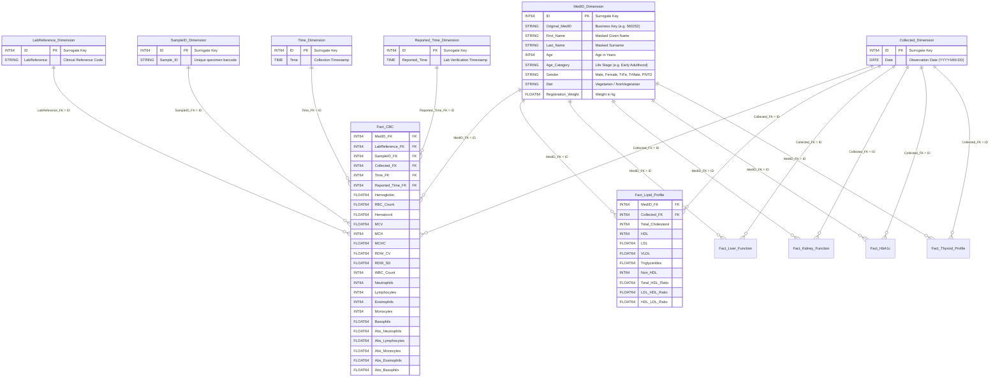

# Database & Data Warehouse Schema Reference

## 1. Overview

The **Biomarker Observatory** data warehouse model is built on an enterprise **Star Schema** architecture. It transforms flat, denormalized medical laboratory records into a fully normalized analytical schema consisting of:
- **6 Dimension Tables** (capturing Patient Demographics, Lab References, Sample IDs, Dates, and Times)
- **14 Fact Tables** (segregating clinical measures by diagnostic discipline)
- **14 Analytics Views** (flattened, pre-joined, null-safe SQL views optimized for the dashboard)

The schema is implemented across three targets:
1. **Google BigQuery** (Dataset: `bigquery-tutorial-480009.A2`)
2. **MySQL 8.0 / phpMyAdmin** (`Dataset/Script/MySQL/healthcare_dashboard_mysql.sql`)
3. **In-Memory CSV Engine** (`Dataset/Medical Records.csv` via `src/lib/local-dataset.ts`)

---

## 2. Entity-Relationship Diagram (Star Schema)



---

## 3. Dimension Tables Specification

| Table Name | Surrogate PK | Natural/Source Key | Key Attributes | Source File |
| :--- | :--- | :--- | :--- | :--- |
| **`MedID_Dimension`** | `ID` (INT64) | `Original_MedID` | `First_Name`, `Last_Name`, `Age`, `Age_Category`, `Gender`, `Diet`, `Registration_Weight` | `MedIDDetails.csv` $\bowtie$ `AgeCategories.csv` |
| **`LabReference_Dimension`** | `ID` (INT64) | `LabReference` | `LabReference` | `Medical Records.csv` $\cup$ `MedIDDetails.csv` |
| **`SampleID_Dimension`** | `ID` (INT64) | `Sample_ID` | `Sample_ID` | `Medical Records.csv` |
| **`Collected_Dimension`** | `ID` (INT64) | `Date` | `Date` (DATE format `YYYY-MM-DD`) | `Medical Records.csv` |
| **`Time_Dimension`** | `ID` (INT64) | `Time` | `Time` (TIME format `HH:MM:SS`) | `Medical Records.csv` |
| **`Reported_Time_Dimension`**| `ID` (INT64) | `Reported_Time`| `Reported_Time` (TIME format `HH:MM:SS`)| `Medical Records.csv` |

---

## 4. Fact Tables Specification

Each Fact Table stores **6 foreign keys** linking back to the dimension tables, plus numerical clinical measures:

| # | Fact Table Name | Measure Count | Measures Included | SQL Script |
| :- | :--- | :-: | :--- | :--- |
| 1 | **`Fact_CBC`** | 19 | `Hemoglobin`, `RBC_Count`, `Hematocrit`, `MCV`, `MCH`, `MCHC`, `RDW_CV`, `RDW_SD`, `WBC_Count`, `Neutrophils`, `Lymphocytes`, `Eosinophils`, `Monocytes`, `Basophils`, `Abs_Neutrophils`, `Abs_Lymphocytes`, `Abs_Monocytes`, `Abs_Eosinophils`, `Abs_Basophils` | `Dataset/Script/Fact/Fact_CBC.sql` |
| 2 | **`Fact_Platelet_Profile`** | 9 | `Platelet_Count`, `MPV`, `Platelet_RDW`, `PCT`, `P_LCR`, `IMG`, `IMM`, `IML`, `LIC` | `Dataset/Script/Fact/Fact_Platelet_Profile.sql` |
| 3 | **`Fact_Lipid_Profile`** | 9 | `Total_Cholesterol`, `HDL`, `LDL`, `VLDL`, `Triglycerides`, `Non_HDL`, `Total_HDL_Ratio`, `LDL_HDL_Ratio`, `HDL_LDL_Ratio` | `Dataset/Script/Fact/Fact_Lipid_Profile.sql` |
| 4 | **`Fact_Liver_Function`** | 11 | `Bilirubin_Total`, `Bilirubin_Direct`, `Bilirubin_Indirect`, `ALP`, `ALT_SGPT`, `AST_SGOT`, `GGT`, `Protein_Total`, `Albumin`, `Globulin`, `A_G_Ratio` | `Dataset/Script/Fact/Fact_Liver Function.sql` |
| 5 | **`Fact_Kidney_Function`** | 9 | `Creatinine`, `Urea`, `BUN`, `BUN_Creatinine_Ratio`, `Sodium`, `Potassium`, `Chloride`, `Uric_Acid`, `eGFR` | `Dataset/Script/Fact/Fact_Kidney_Function.sql` |
| 6 | **`Fact_Iron_Profile`** | 4 | `Iron`, `UIBC`, `TIBC`, `Transferrin_Saturation` | `Dataset/Script/Fact/Fact_Iron_Profile.sql` |
| 7 | **`Fact_HbA1c`** | 3 | `HbA1c`, `Estimated_Avg_Glucose`, `HbF` | `Dataset/Script/Fact/Fact_HbA1c.sql` |
| 8 | **`Fact_Urine_ACR`** | 3 | `Urine_Albumin`, `Urine_Creatinine`, `Albumin_Creatinine_Ratio` | `Dataset/Script/Fact/Fact_Urine_ACR.sql` |
| 9 | **`Fact_Calcium_Phos`** | 2 | `Calcium`, `Phosphorus` | `Dataset/Script/Fact/Fact_Calcium_Phos.sql` |
| 10 | **`Fact_Thyroid_Profile`** | 3 | `TT3`, `TT4`, `TSH` | `Dataset/Script/Fact/Fact_Thyroid_Profile.sql` |
| 11 | **`Fact_Glucose_Fasting`** | 1 | `Fasting_Glucose` | `Dataset/Script/Fact/Fact_Glucose_Fasting.sql` |
| 12 | **`Fact_Glucose_PP`** | 1 | `Postprandial_Glucose` | `Dataset/Script/Fact/Fact_Glucose_PP.sql` |
| 13 | **`Fact_Glucose_Diagnopath`**| 2 | `FBS`, `PLBS` | `Dataset/Script/Fact/Fact_Glucose_Diagnopath.sql` |
| 14 | **`Fact_Urine`** | 17 | `Specific_Gravity`, `pH`, `Colour`, `Appearance`, `Proteins`, `Glucose`, `Bilirubin`, `Ketones`, `Blood`, `Urobilinogen`, `Nitrites`, `WBC_Pus_Cells`, `RBC`, `Epithelial_Cells`, `Casts`, `Crystals`, `Others` | `Dataset/Script/Fact/Fact_Urine.sql` |

---

## 5. Analytics Views Specification

The 14 analytics views join the Fact tables to `MedID_Dimension` and `Collected_Dimension`, exposing clean, flattened column names for the dashboard query engine:

```sql
CREATE OR REPLACE VIEW `bigquery-tutorial-480009.A2.View_Fact_CBC` AS
SELECT 
    IFNULL(m.Original_MedID, 'Unknown') AS Original_MedID,
    IFNULL(m.First_Name, 'Unknown') AS First_Name,
    IFNULL(m.Last_Name, 'Unknown') AS Last_Name,
    IFNULL(m.Gender, 'Unknown') AS Gender,
    IFNULL(m.Age_Category, 'Unknown') AS Age_Category,
    c.Date AS Test_Date,
    f.Hemoglobin,
    f.RBC_Count,
    f.Hematocrit,
    f.MCV,
    f.MCH,
    f.MCHC,
    f.RDW_CV,
    f.RDW_SD,
    f.WBC_Count,
    f.Neutrophils,
    f.Lymphocytes,
    f.Eosinophils,
    f.Monocytes,
    f.Basophils,
    f.Abs_Neutrophils,
    f.Abs_Lymphocytes,
    f.Abs_Monocytes,
    f.Abs_Eosinophils,
    f.Abs_Basophils
FROM `bigquery-tutorial-480009.A2.Fact_CBC` AS f
LEFT JOIN `bigquery-tutorial-480009.A2.MedID_Dimension` AS m ON f.MedID_FK = m.ID
LEFT JOIN `bigquery-tutorial-480009.A2.Collected_Dimension` AS c ON f.Collected_FK = c.ID;
```

---

## 6. Raw CSV Source Data Dictionary (`Medical Records.csv`)

| Column Name | Category Panel | Type | Clinical Reference Range | Unit |
| :--- | :--- | :--- | :--- | :--- |
| `MedID` | Identifier | Integer | Patient ID | - |
| `Collected` | Temporal | Date | `2018-08-24` to `2019-07-24` | `YYYY-MM-DD` |
| `Hemoglobin (g/dL)` | CBC | Float | 12.0 – 17.5 | g/dL |
| `RBC Count (mil/µL)` | CBC | Float | 4.0 – 6.0 | $\times 10^6$/µL |
| `Hematocrit %` | CBC | Float | 36.0 – 52.0 | % |
| `WBC (cells/µL)` | CBC | Integer | 4,000 – 11,000 | cells/µL |
| `Platelet Count (×10^3/µL)` | Platelet | Integer | 150 – 400 | $\times 10^3$/µL |
| `Total Cholesterol (mg/dL)` | Lipid | Float | 0 – 200 | mg/dL |
| `HDL (mg/dL)` | Lipid | Float | 40 – 60 | mg/dL |
| `LDL (mg/dL)` | Lipid | Float | 0 – 100 | mg/dL |
| `Triglycerides (mg/dL)` | Lipid | Float | 0 – 150 | mg/dL |
| `ALT/SGPT (U/L)` | Liver | Float | 7 – 56 | U/L |
| `AST/SGOT (U/L)` | Liver | Float | 10 – 40 | U/L |
| `Bilirubin Total (mg/dL)` | Liver | Float | 0.1 – 1.2 | mg/dL |
| `Creatinine (mg/dL)` | Kidney | Float | 0.6 – 1.2 | mg/dL |
| `Urea (mg/dL)` | Kidney | Float | 15 – 45 | mg/dL |
| `BUN (mg/dL)` | Kidney | Float | 7 – 20 | mg/dL |
| `eGFR (mL/min/1.73m²)` | Kidney | Float | 90 – 120 | mL/min/1.73m² |
| `HbA1c %` | HbA1c | Float | 4.0 – 5.6 | % |
| `Fasting Glucose (mg/dL)` | Glucose | Float | 70 – 99 | mg/dL |
| `Postprandial Glucose (mg/dL)`| Glucose | Float | 70 – 140 | mg/dL |
| `TSH (µIU/mL)` | Thyroid | Float | 0.27 – 4.20 | µIU/mL |
| `TT3 (ng/dL)` | Thyroid | Float | 80 – 200 | ng/dL |
| `TT4 (µg/dL)` | Thyroid | Float | 5.1 – 14.1 | µg/dL |
| `Calcium (mg/dL)` | Mineral | Float | 8.5 – 10.5 | mg/dL |
| `Phosphorus (mg/dL)` | Mineral | Float | 2.5 – 4.5 | mg/dL |
| `Iron (µg/dL)` | Iron | Float | 60 – 170 | µg/dL |
| `Transferrin Saturation %` | Iron | Float | 20 – 50 | % |
| `Specific Gravity` | Urine | Float | 1.005 – 1.030 | - |
| `pH` | Urine | Float | 4.5 – 8.0 | - |
