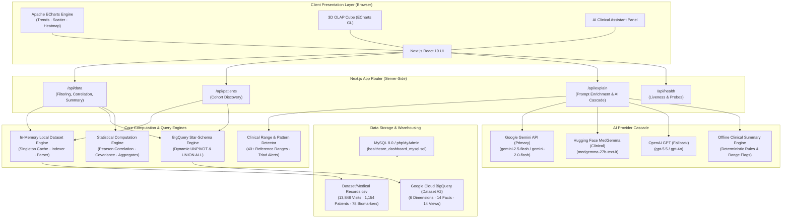
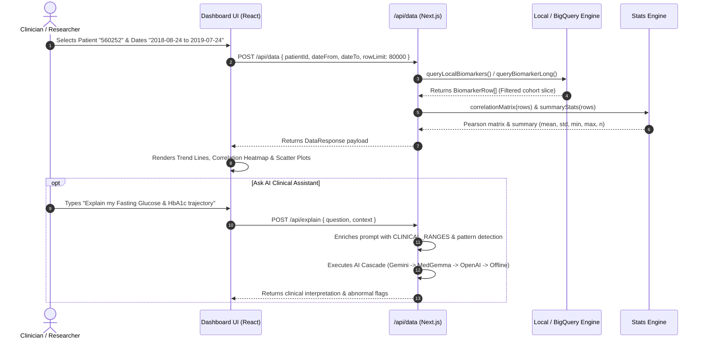

# System Design & Architecture — Biomarker Observatory

## 1. Executive Summary

The **Biomarker Observatory** is a production-grade healthcare data intelligence platform engineered to ingest, normalize, and visualize longitudinal patient biomarker measurements across cohorts. The system provides sub-second query performance over tens of thousands of records, computes real-time statistical metrics (including Pearson correlation matrices and cohort aggregates), facilitates multidimensional slicing via a 3D OLAP Cube, and delivers AI-assisted clinical reasoning grounded in standardized clinical reference ranges.

---

## 2. High-Level Architecture Diagram

---

## 3. Core Architectural Subsystems

### 3.1. In-Memory Local Dataset Engine (`src/lib/local-dataset.ts`)
- **Purpose**: Provides instantaneous, zero-cloud data loading for local prototypes, air-gapped clinical deployments, or environments where cloud API keys have expired.
- **Mechanism**:
  - Employs a **singleton memory pattern** (`loadLocalDataset()`). On the first API call, the 6.6 MB CSV file is read and indexed in under 15ms.
  - **Date Normalization**: Seamlessly resolves Excel serial day offsets (e.g. `43549` $\rightarrow$ `2019-03-25`), international `DD/MM/YYYY` dates, and `YYYY-MM-DD` strings.
  - **Transposition & Indexing**: Normalizes 78 wide-format observation columns into long-format records (`patient_id`, `visit_date`, `biomarker`, `value`, `group`), while maintaining a per-patient index map (`Map<string, LocalDatasetRecord[]>`) for instant single-patient queries ($<1\text{ms}$).

### 3.2. BigQuery Data Warehouse Engine (`src/lib/bigquery.ts`)
- **Purpose**: Enterprise cloud scalability over petabyte-scale data lakes.
- **Mechanism**:
  - Dynamically inspects table schemas at runtime using `INFORMATION_SCHEMA.COLUMNS` to discover numeric measures.
  - Generates parameter-safe `UNPIVOT` statements on demand for each view table.
  - Bundles all fact views into a single-pass `UNION ALL` query, bounded by a 5 GB billing ceiling (`maximumBytesBilled`) for cost governance.

### 3.3. Statistical Analysis Engine (`src/lib/stats.ts`)
- **Purpose**: Computes cohort-wide statistical correlations and descriptive distribution metrics on the fly.
- **Formulas & Algorithm**:
  - **Pairwise Pearson Correlation**:
    $$\rho_{X, Y} = \frac{n \sum xy - \sum x \sum y}{\sqrt{(n \sum x^2 - (\sum x)^2)(n \sum y^2 - (\sum y)^2)}}$$
  - **Same-Visit Pairing**: Grouping rows by `patient_id|visit_date` ensures correlation calculations only compare measurements obtained synchronously during the same clinical encounter.
  - **Sample Variance with Bessel's Correction**:
    $$s^2 = \frac{1}{n - 1} \sum_{i=1}^n (x_i - \bar{x})^2$$

### 3.4. Multidimensional OLAP Engine (`src/components/OlapCube.tsx`)
- **Purpose**: Enables true multi-dimensional drill-down, roll-up, slicing, and dicing across 4 dimensions:
  1. **Time** (Granularity: Day vs Month)
  2. **Biomarker** (Individual assay selection)
  3. **Patient Cohort** (Single patient vs multi-patient selection)
  4. **Clinical Panel Group** (e.g., CBC, Lipid, Liver, Renal)
- **Visual Projection**: Renders a 3D bar matrix using **ECharts GL** with orbital camera controls alongside synchronized 2D heatmap projections.

### 3.5. Cascading AI Clinical Assistant (`src/app/api/explain/route.ts`)
- **Purpose**: Translates complex numeric lab distributions into actionable clinical insights with evidence-based guardrails.
- **Cascade Architecture**:
  1. **Google Gemini** (`gemini-2.5-flash`): Primary LLM utilizing REST API key authentication.
  2. **Hugging Face MedGemma** (`medgemma-27b-text-it`): Specialized open medical foundation model.
  3. **OpenAI GPT** (`gpt-5.5` / `gpt-4o`): Secondary fallback provider.
  4. **Offline Clinical Rule Engine**: Deterministic fallback checking measurements against `CLINICAL_RANGES` and generating structured clinical summaries when no external network or API key is accessible.

---

## 4. Data Flow Walkthrough

---

## 5. Non-Functional Requirements & Design Decisions

| Attribute | Implementation Strategy | Rationale |
| :--- | :--- | :--- |
| **Latency** | In-memory singleton caching (`local-dataset.ts`) | Query responses under 10ms for full-cohort slicing (13,848 rows). |
| **Reliability** | 4-tier AI cascade + 3-tier data source fallback | Zero crashes even when external cloud credentials expire or network fails. |
| **Type Safety** | Strict TypeScript 5.7 + Zod runtime validation | Prevents runtime schema mismatch between client, server, and SQL. |
| **Security & Privacy** | `.secrets/`, `.env.local` strictly gitignored; patient data contained locally | Complies with patient privacy and prevents accidental API key leakage. |
| **Extensibility** | Universal `BiomarkerRow` contract | New data sources (DuckDB, PostgreSQL, FHIR) can be added with zero UI changes. |
